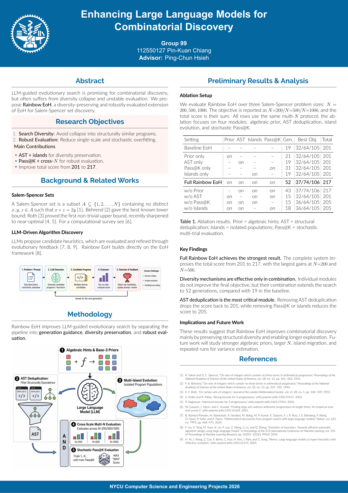

# Rainbow EoH

**Enhancing Large Language Models for Combinatorial Discovery**

Rainbow EoH 以 Fei Liu 等作者提出的 [EoH（Evolution of Heuristics）](https://github.com/FeiLiu36/EoH) 為基礎，結合大型語言模型（LLM）與演化搜尋，自動產生並改進尋找 **Salem–Spencer 集合**的啟發式演算法。專案著重於保留搜尋過程中的程式多樣性，以及讓評估結果更穩健。

Salem–Spencer 集合是 `{1, 2, ..., N}` 的子集合，其中任意三個相異元素都不能形成等差數列，也就是不存在 `x + z = 2y`。我們的目標是在這個限制下，找出盡可能大的集合。

## 方法

LLM 產生候選程式後，系統會評估其結果、選出表現較好的候選，再透過演化回饋持續改進。Rainbow EoH 加入以下設計：

- **代數先驗提示**：提供代數與三進位構造的線索，引導程式生成。
- **AST 結構去重**：透過抽象語法樹辨識結構相似的程式，減少重複搜尋。
- **多島嶼演化（Islands）**：以不同族群探索多種策略，維持搜尋多樣性。
- **跨規模評估（Cross-N）**：同時在 `N = 200、500、1000` 上評估，降低只適用於單一規模的情況。
- **隨機多次評估（Pass@K）**：以不同隨機種子測試隨機演算法，取最佳有效結果。

## 初步結果

以下數據整理自 [研究海報](poster.pdf)，分數為各規模下找到的有效集合大小，總分為三者相加。

| 方法 | N = 200 | N = 500 | N = 1000 | 總分 |
| --- | ---: | ---: | ---: | ---: |
| Baseline EoH | 32 | 64 | 105 | 201 |
| Rainbow EoH | **37** | **74** | **106** | **217** |

海報中的消融實驗顯示，移除 AST 去重後總分降回 201；移除 Pass@K 或 Islands 則降至 205，顯示這些機制搭配使用有助於改善搜尋結果。

## 專案內容

- [`EoH-llama4/eoh/`](EoH-llama4/eoh/)：演化搜尋框架與問題評估實作。
- [`EoH-llama4/examples/salem_spencer/`](EoH-llama4/examples/salem_spencer/)：Salem–Spencer 實驗入口、評估與繪圖程式。
- [`EoH-llama4/README.md`](EoH-llama4/README.md)：原始 EoH 框架說明。

## 基本執行方式

使用 Python 3.10 以上版本，在專案根目錄安裝：

```bash
python -m pip install ./EoH-llama4/eoh requests
```

先在 [`runEoH.py`](EoH-llama4/examples/salem_spencer/runEoH.py) 設定自己的 LLM API endpoint、API key 與模型名稱，也可調整族群大小及演化代數，再執行：

```bash
cd EoH-llama4/examples/salem_spencer
python runEoH.py
```

## 致謝與引用

本專案基於原始 EoH 程式碼進行擴充，感謝原作者與開源貢獻者提供研究及實作基礎。

- **原作者**：Fei Liu、Xialiang Tong、Mingxuan Yuan、Xi Lin、Fu Luo、Zhenkun Wang、Zhichao Lu、Qingfu Zhang。
- **原始 Repository**：[FeiLiu36/EoH](https://github.com/FeiLiu36/EoH)。
- **論文**：[Evolution of Heuristics: Towards Efficient Automatic Algorithm Design Using Large Language Model](https://proceedings.mlr.press/v235/liu24bs.html)，ICML 2024。

若研究中使用到 EoH 框架，請引用原始論文：

```bibtex
@inproceedings{fei2024eoh,
  title = {Evolution of Heuristics: Towards Efficient Automatic Algorithm Design Using Large Language Model},
  author = {Liu, Fei and Tong, Xialiang and Yuan, Mingxuan and Lin, Xi and Luo, Fu and Wang, Zhenkun and Lu, Zhichao and Zhang, Qingfu},
  booktitle = {Proceedings of the 41st International Conference on Machine Learning},
  year = {2024},
  volume = {235},
  pages = {32201--32223},
  series = {Proceedings of Machine Learning Research},
  url = {https://proceedings.mlr.press/v235/liu24bs.html}
}
```

## Poster

點擊圖片可開啟完整 PDF。

[](poster.pdf)

NYCU Computer Science and Engineering Projects 2026  
作者：Pin-Kuan Chiang（Group 99）／指導教授：Ping-Chun Hsieh
